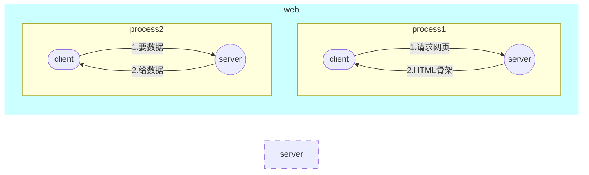
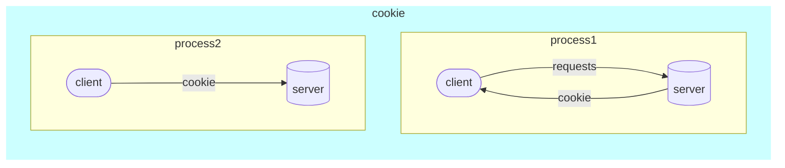

# crawl入门
## web请求过程

1. 服务器渲染：服务器将数据和HTML整合返回给浏览器
2. 客户端渲染：第一次请求得到HTML骨架，第二次请求得到数据，进行展示。

## HTTP协议
- **请求：**
> 请求行：请求方式(get/post) 请求url地址 协议
>
> 请求头：服务器需要的附加信息
> 
> 请求体：请求参数

User-Agent：请求载体的身份表示

Referer：防盗链（请求从哪个页面来/ 反爬用）

cookie：本地字符串数据信息（用户信息，反爬tocken）

- **响应：**
> 状态行： 协议 状态码(200/ 404/ 500/ 302)
> 
> 响应头：客户端需要的附加信息
> 
> 响应体：服务器真正返回的内容(HTML, json)

cookie

各种字符串（tocken字样/防止攻击和反爬）

- **请求方式**

- GET：查询（显示提交
- POST：增加/修改/上传（隐式提交

## Coookie

